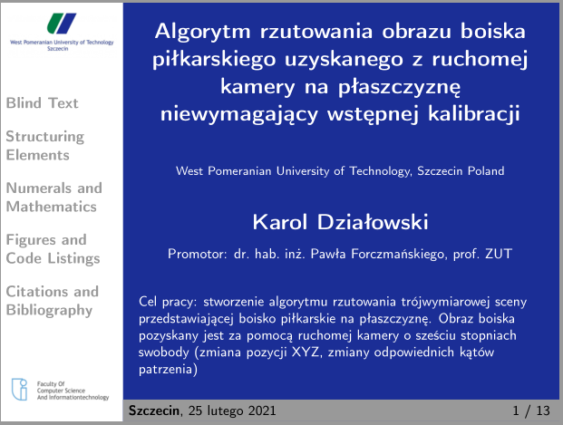
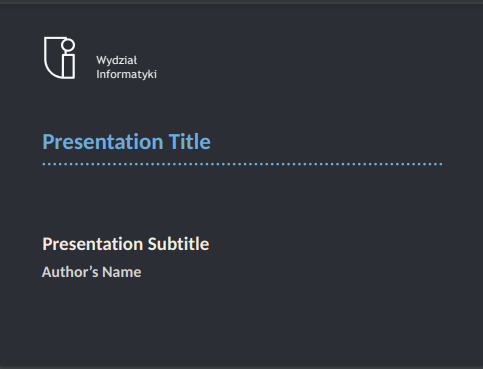
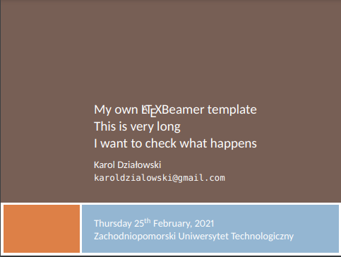
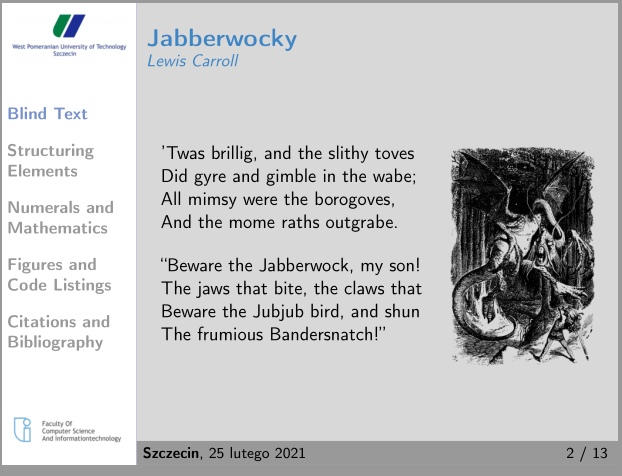
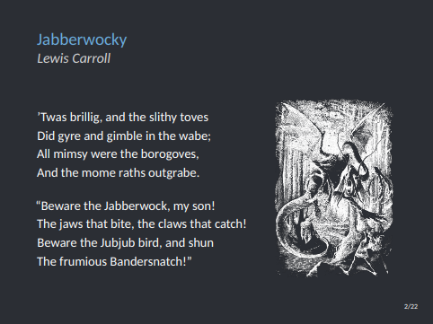
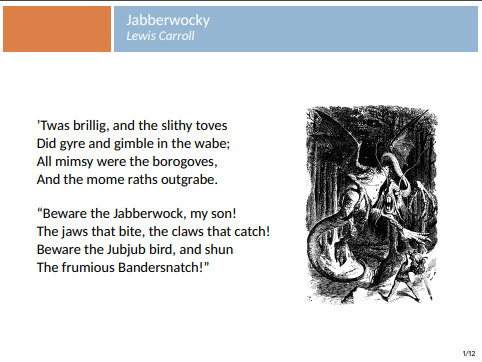
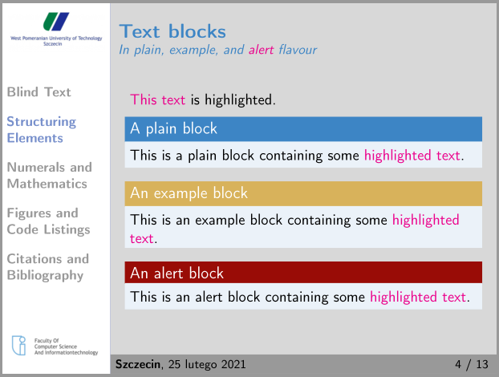
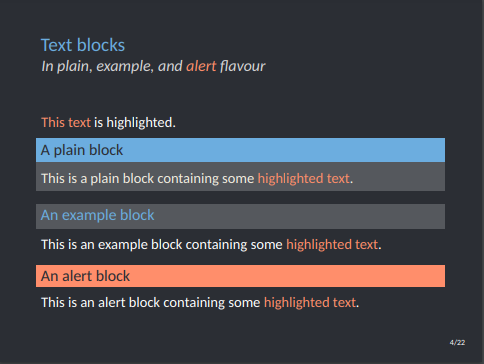
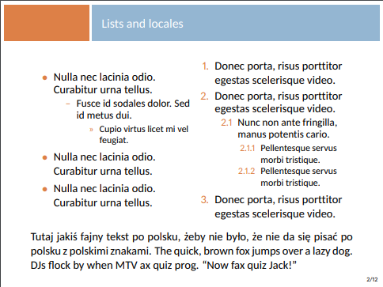

***

<h4 align="center">ZUT Beamer template</h4>

  <a href="#what-is-this-and-who-is-this-for-">What is this and who is this for</a> •
  <a href="#development-">Development</a> •
  <a href="#live-demo-">Live demo</a> •
  <a href="#known-bugs-">Known bugs</a> •
  <a href="#my-other-templates">My other templates</a>

  
  
  

## What is this and who is it for 🤷‍♀️

This project was made for my dissertaion presentation. I also wanted to improve my LaTeX skills. Theme was heavily inspired by [Radosław Mantiuk ZUT pptx template](http://rmantiuk.zut.edu.pl/index.php/prace-dyplomowe/).

## Development 🚀

Compile `presentation.tex` with `pdflatex presentation.tex`. Or upload the [zipped project](https://github.com/karlosos/ZUTBeamer/archive/main.zip) to Overleaf.

## Live demo ✨

You can see [example pdf output here](https://github.com/karlosos/ZUTBeamer/releases/download/1.0/ZUTBeamer-example.pdf). As an alternative you can use Overleaf. This theme is available as a [Overleaf template here](https://www.overleaf.com/latex/templates/zutbeamer/wfztwrddyvdb).

## Known bugs 🐛

If you found something please add a ticket [here](https://github.com/karlosos/ZUTBeamer/issues).

  
Changing language and logos

  
  You can change `\supervisor` and `\goal` prefixes in the file [zutbeamer/beamerinnerthemezutbeamer.sty](https://github.com/karlosos/ZUTBeamer/blob/main/zutbeamer/beamerinnerthemezutbeamer.sty#L51) as described in this issue: https://github.com/karlosos/ZUTBeamer/issues/5

## My other templates

| [ZUTBeamer](https://github.com/karlosos/ZUTBeamer) | [ZUTfibeamer](https://github.com/karlosos/zut-fibeamer) | [Scratch](https://github.com/karlosos/beamer-template-scratch) | 
| ------ | -------- | -------- | 
|  |  | 
|  |  | 
|  |  | 
